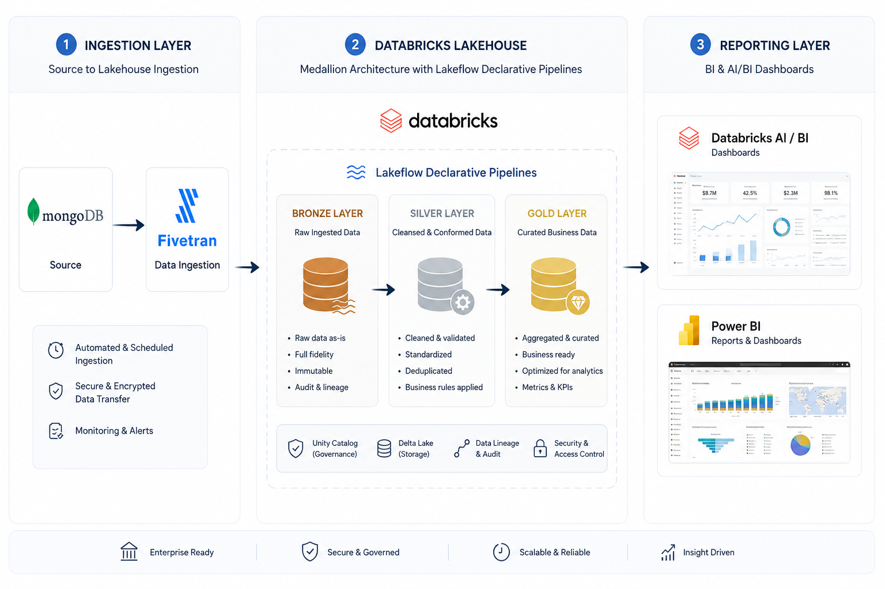

# Hospital Management Data Engineering Project 🏥

[](https://databricks.com)
[](https://www.mongodb.com)
[](https://delta.io)
[](https://fivetran.com)

Enterprise-grade data engineering pipeline for hospital management analytics, built on **Databricks Lakehouse** using **Medallion Architecture** (Bronze-Silver-Gold layers) with **Unity Catalog** governance.

---

## 📊 Architecture Overview



> **Architecture Diagram**: The image above shows the complete data flow from MongoDB (source) → Fivetran (CDC ingestion) → Databricks Lakehouse (Medallion Architecture: Bronze/Silver/Gold) → Reporting Layer (AI/BI Dashboards & Power BI).

### Three-Layer Architecture

```
┌─────────────────────────────────────────────────────────────────────────┐
│                          INGESTION LAYER                                │
│  MongoDB (Source) → Fivetran (CDC) → Databricks Bronze Layer            │
└─────────────────────────────────────────────────────────────────────────┘
                                    │
                                    ↓
┌─────────────────────────────────────────────────────────────────────────┐
│                      DATABRICKS LAKEHOUSE                               │
│                  Medallion Architecture with Lakeflow                   │
│                                                                         │
│  ┌─────────────┐      ┌─────────────┐      ┌─────────────┐           │
│  │   BRONZE    │  →   │   SILVER    │  →   │    GOLD     │           │
│  │  Raw Data   │      │ Clean Data  │      │  Analytics  │           │
│  └─────────────┘      └─────────────┘      └─────────────┘           │
│       ↓                     ↓                     ↓                    │
│  • Full fidelity      • Validated         • Aggregated               │
│  • Immutable          • Standardized      • Business KPIs            │
│  • Audit trail        • Deduplicated      • Optimized for BI         │
└─────────────────────────────────────────────────────────────────────────┘
                                    │
                                    ↓
┌─────────────────────────────────────────────────────────────────────────┐
│                        REPORTING LAYER                                  │
│        Databricks AI/BI Dashboards  |  Power BI  |  Reports            │
└─────────────────────────────────────────────────────────────────────────┘
```

**Key Features:**
* ✅ **Enterprise-Ready**: Automated & scheduled ingestion
* 🔒 **Secure & Governed**: Unity Catalog with RBAC
* ⚡ **Scalable & Reliable**: Delta Lake ACID transactions
* 📊 **Insight-Driven**: Real-time analytics & KPIs

---

## 🏗️ Project Structure

```
hospital-data-engineering-project/
│
├── 📁 setup/                                # Initial setup scripts
│   └── 📄 upload_to_mongodb.py              # MongoDB data loader
│
├── 📁 src/                                  # Source code
│   ├── 📁 ingestion/                        # Bronze Layer (Raw Data)
│   │   └── 📓 01_bronze_patient_ingestion.py
│   ├── 📁 transformation/                   # Silver Layer (Clean Data)
│   │   └── 📓 02_silver_patient_transformation.py
│   └── 📁 analytics/                        # Gold Layer (Analytics)
│       └── 📓 03_gold_patient_analytics.py
│
├── 📁 config/                               # Configuration
│   └── 🐍 pipeline_config.py                # Centralized settings
│
├── 📁 docs/                                 # Documentation
│   └── 📄 ARCHITECTURE.md                   # Detailed architecture
│
├── 📁 img/                                  # Images & diagrams
│   └── 🖼️ project_architecture.png          # Architecture diagram
│
├── 📁 utils/                                # Utilities
│   └── 🐍 data_quality.py                   # Quality validation
│
├── 📁 tests/                                # Test scripts
│
├── 📁 dashboards/                           # BI dashboards
│
├── 📄 README.md                             # This file
└── 📄 PROJECT_SUMMARY.md                    # Migration report
```

---

## 🚀 Quick Start

### Prerequisites

* **Databricks Workspace** with Unity Catalog enabled
* **MongoDB Atlas** cluster with hospital data
* **Fivetran** connector configured for MongoDB → Databricks
* **Python 3.9+** with PySpark

### Step 1: Setup MongoDB Data Source

```bash
cd setup/
pip install pymongo pandas
python upload_to_mongodb.py
```

This will:
* Connect to MongoDB Atlas
* Upload 10,000 patient records from CSV
* Prepare data for Fivetran ingestion

### Step 2: Configure Fivetran CDC

1. Login to Fivetran console
2. Create MongoDB connector
3. Select `hospital_db` database
4. Configure sync to Databricks catalog: `dbutils_catalog.hospital_db`
5. Start initial sync

### Step 3: Create Unity Catalog Schemas

```sql
CREATE CATALOG IF NOT EXISTS dbutils_catalog;
USE CATALOG dbutils_catalog;

CREATE SCHEMA IF NOT EXISTS hospital_db;       -- Source (via Fivetran)
CREATE SCHEMA IF NOT EXISTS bronze_hospital;   -- Bronze layer
CREATE SCHEMA IF NOT EXISTS silver_hospital;   -- Silver layer
CREATE SCHEMA IF NOT EXISTS gold_hospital;     -- Gold layer
```

### Step 4: Run Medallion Pipeline

Execute notebooks in sequence:

```python
# 1. Bronze Layer - Raw Ingestion
/src/ingestion/01_bronze_patient_ingestion

# 2. Silver Layer - Transformation
/src/transformation/02_silver_patient_transformation

# 3. Gold Layer - Analytics
/src/analytics/03_gold_patient_analytics
```

---

## 📊 Data Flow

### 🔵 Bronze Layer (Ingestion)

**Purpose**: Raw data capture with full fidelity

**Notebook**: `src/ingestion/01_bronze_patient_ingestion.py`

**Operations**:
* Load raw patient data from `hospital_db.patients` (Fivetran synced)
* Store in `bronze_hospital.patients_raw` (Delta Lake)
* Preserve Fivetran metadata (`_fivetran_synced`, `_fivetran_deleted`)
* No transformations - full audit trail

**Output Table**: `dbutils_catalog.bronze_hospital.patients_raw`

**Schema**:
```
_id                 STRING
_fivetran_synced    TIMESTAMP
data                STRING (JSON)
_fivetran_deleted   BOOLEAN
```

---

### ⚪ Silver Layer (Transformation)

**Purpose**: Clean, validated, structured data

**Notebook**: `src/transformation/02_silver_patient_transformation.py`

**Operations**:
* Parse JSON `data` field into structured columns
* Standardize text fields (gender: UPPER, city: Title Case)
* Create derived fields (`age_group`: Child/Adult/Senior)
* Filter soft-deleted records (`_fivetran_deleted = false`)
* Data quality validation

**Output Table**: `dbutils_catalog.silver_hospital.patients_clean`

**Schema** (13 columns):
```
patient_id          INT
patient_name        STRING
age                 INT
gender              STRING
city                STRING
disease             STRING
doctor_name         STRING
hospital_name       STRING
admission_date      STRING
discharge_date      STRING
bill_amount         INT
payment_method      STRING
loaded_at           TIMESTAMP
age_group           STRING (derived)
```

---

### 🟡 Gold Layer (Analytics)

**Purpose**: Business-level aggregations and KPIs

**Notebook**: `src/analytics/03_gold_patient_analytics.py`

**Operations**:
* Create 8 analytics tables
* Aggregate metrics by dimensions (city, disease, hospital, doctor)
* Calculate KPIs (patient count, revenue, average bill)
* Optimize for BI dashboards

**Output Tables**:

| Table | Description | Key Metrics |
|-------|-------------|-------------|
| `demographics_summary` | Gender-wise statistics | Total patients, avg/min/max age |
| `city_patient_distribution` | City-wise metrics | Patient count, average age |
| `age_group_analysis` | Age group breakdown | Count by age group & gender |
| `disease_analysis` | Disease statistics | Patient count, avg bill amount |
| `hospital_performance` | Hospital KPIs | Total patients, revenue, avg revenue |
| `doctor_analysis` | Doctor performance | Patient count, avg bill |
| `payment_analysis` | Payment insights | Transaction count, total/avg amount |
| `city_revenue_analysis` | Revenue by city | Patient count, total/avg revenue |

---

## 📈 Key Metrics & KPIs

### Data Volume
* **Total Patients**: 10,000+
* **Cities Covered**: 10 (Mumbai, Delhi, Bangalore, Chennai, Kolkata, Patna, Pune, Jaipur, Lucknow, Ranchi)
* **Diseases Tracked**: 12 (Diabetes, Hypertension, Heart Disease, Cancer, COVID-19, Dengue, Malaria, Fever, Asthma, Migraine, Kidney Stone, Fracture)
* **Hospitals**: 5 networks (Apollo Care, LifeCare, Medistar, City Hospital, Sunrise Medical)
* **Time Period**: 2023-2026

### Business KPIs
* Average bill amount per patient
* Patient distribution by city
* Disease prevalence analysis
* Hospital performance comparison
* Doctor workload metrics
* Payment method trends

---

## 🔧 Configuration

### Pipeline Config

Edit `config/pipeline_config.py`:

```python
from config.pipeline_config import CONFIG, get_table_path

# Access settings
print(CONFIG.catalog.catalog_name)        # dbutils_catalog
print(CONFIG.catalog.bronze_schema)       # bronze_hospital
print(CONFIG.catalog.silver_schema)       # silver_hospital
print(CONFIG.catalog.gold_schema)         # gold_hospital

# Get table paths
bronze_path = get_table_path("bronze", "patients_raw")
# Returns: dbutils_catalog.bronze_hospital.patients_raw
```

**Configuration includes**:
* Catalog and schema names
* Table name mappings
* Data quality rules
* Performance settings (shuffle partitions, broadcast threshold)
* Data retention policies

---

## ✅ Data Quality

### Validation Framework

Use `utils/data_quality.py` for automated checks:

```python
from utils.data_quality import DataQualityChecker, run_full_pipeline_validation

# Initialize checker
checker = DataQualityChecker()

# Validate specific layer
bronze_report = checker.validate_bronze_layer()
silver_report = checker.validate_silver_layer()
gold_report = checker.validate_gold_layer()

# Full pipeline validation
full_report = run_full_pipeline_validation()
```

**Quality Checks**:
* ✓ Null value detection
* ✓ Duplicate record identification
* ✓ Schema validation
* ✓ Data completeness percentage
* ✓ Record count validation
* ✓ Range and constraint checks

---

## 📝 Sample Queries

### Top 10 Diseases by Patient Count
```sql
SELECT disease, patient_count
FROM dbutils_catalog.gold_hospital.disease_analysis
ORDER BY patient_count DESC
LIMIT 10;
```

### City-wise Revenue Analysis
```sql
SELECT 
    city,
    patient_count,
    total_revenue,
    avg_bill
FROM dbutils_catalog.gold_hospital.city_revenue_analysis
ORDER BY total_revenue DESC;
```

### Hospital Performance Leaderboard
```sql
SELECT 
    hospital_name,
    total_patients,
    total_revenue,
    avg_revenue_per_patient
FROM dbutils_catalog.gold_hospital.hospital_performance
ORDER BY total_patients DESC;
```

### Age Group Distribution
```sql
SELECT 
    age_group,
    gender,
    patient_count
FROM dbutils_catalog.gold_hospital.age_group_analysis
ORDER BY age_group, gender;
```

---

## 🔄 Automation & Scheduling

### Option 1: Databricks Jobs

Create a job with 3 tasks:

1. **Bronze Task**: Run `01_bronze_patient_ingestion`
2. **Silver Task**: Run `02_silver_patient_transformation` (depends on Bronze)
3. **Gold Task**: Run `03_gold_patient_analytics` (depends on Silver)

Schedule: Daily at 2:00 AM UTC

### Option 2: Workflow API

```python
from databricks.sdk import WorkspaceClient

w = WorkspaceClient()

job = w.jobs.create(
    name="Hospital Data Pipeline",
    tasks=[
        {
            "task_key": "bronze",
            "notebook_task": {"notebook_path": "/Workspace/Shared/hospital-data-engineering-project/src/ingestion/01_bronze_patient_ingestion"}
        },
        {
            "task_key": "silver",
            "notebook_task": {"notebook_path": "/Workspace/Shared/hospital-data-engineering-project/src/transformation/02_silver_patient_transformation"},
            "depends_on": [{"task_key": "bronze"}]
        },
        {
            "task_key": "gold",
            "notebook_task": {"notebook_path": "/Workspace/Shared/hospital-data-engineering-project/src/analytics/03_gold_patient_analytics"},
            "depends_on": [{"task_key": "silver"}]
        }
    ],
    schedule={"quartz_cron_expression": "0 0 2 * * ?", "timezone_id": "UTC"}
)
```

---

## 🛠️ Development Guide

### Adding New Analytics

1. **Silver Layer**: Add transformation logic if needed
2. **Gold Layer**: Create new aggregation in `03_gold_patient_analytics`
3. **Config**: Update `pipeline_config.py` with table names
4. **Documentation**: Document in data dictionary

Example:
```python
# In 03_gold_patient_analytics.py

# Payment method by city analysis
payment_city_analysis = patients.groupBy("city", "payment_method").agg(
    count("*").alias("transaction_count"),
    sum("bill_amount").alias("total_amount")
)

payment_city_analysis.write.mode("overwrite").saveAsTable(
    "dbutils_catalog.gold_hospital.payment_city_analysis"
)
```

### Testing

```python
# Run data quality checks
from utils.data_quality import DataQualityChecker

checker = DataQualityChecker()

# Test bronze layer
assert checker.validate_bronze_layer()["row_count"] > 0

# Test silver layer
assert checker.validate_silver_layer()["completeness_pct"] > 95

# Test gold layer
gold_report = checker.validate_gold_layer()
assert len(gold_report["tables"]) == 8
```

---

## 🔐 Security & Governance

### Unity Catalog

* **Catalog**: `dbutils_catalog` - centralized metadata
* **Schemas**: Separate schemas per layer (bronze/silver/gold)
* **Access Control**: RBAC with grants
* **Audit Logs**: Automatic lineage tracking

### Grant Permissions

```sql
-- Grant read access to analytics team
GRANT SELECT ON SCHEMA dbutils_catalog.gold_hospital TO `analytics_team`;

-- Grant read/write to data engineering team
GRANT ALL PRIVILEGES ON SCHEMA dbutils_catalog.bronze_hospital TO `data_eng_team`;
GRANT ALL PRIVILEGES ON SCHEMA dbutils_catalog.silver_hospital TO `data_eng_team`;
GRANT ALL PRIVILEGES ON SCHEMA dbutils_catalog.gold_hospital TO `data_eng_team`;
```

---

## 📚 Documentation

Detailed documentation available in `/docs`:

* **[Architecture Guide](./docs/ARCHITECTURE.md)** - Complete architecture documentation
* **Data Dictionary** - Schema and field descriptions
* **Pipeline Specs** - Technical specifications
* **Deployment Guide** - Production deployment

---

## 🐛 Troubleshooting

### Common Issues

**Issue**: Fivetran sync failing
```
Solution: Check MongoDB connection string and network access
```

**Issue**: Bronze notebook fails with "Table not found"
```
Solution: Ensure Fivetran has completed initial sync of hospital_db
```

**Issue**: Silver notebook JSON parsing errors
```
Solution: Verify JSON schema matches source data structure
```

**Issue**: Gold tables empty
```
Solution: Verify silver layer completed successfully before running gold
```

---

## 🤝 Contributing

1. Create feature branch: `git checkout -b feature/new-analytics`
2. Make changes and test thoroughly
3. Update documentation
4. Submit pull request with detailed description

### Code Standards

* Follow PEP 8 for Python code
* Use descriptive variable names
* Add markdown cells in notebooks explaining logic
* Include error handling
* Add logging statements

---

## 📞 Support

* **Team**: Data Engineering Team
* **Email**: data-engineering@hospital.com
* **Slack**: #hospital-data-pipeline
* **Jira**: HDP project

---

## 📜 License

Internal use only - Hospital Management System

---

## 🎉 Acknowledgments

* **Platform**: Databricks Lakehouse
* **Ingestion**: Fivetran CDC
* **Storage**: Delta Lake
* **Governance**: Unity Catalog
* **Source**: MongoDB Atlas

---

**Version**: 1.0.0  
**Last Updated**: June 2026  
**Status**: ✅ Production Ready

---

**Built with ❤️ by the Data Engineering Team on Databricks**
